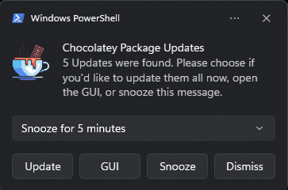

# psChocoUpdateNotify

Searches for chocolatey package updates and notifies the user about it. Includes a GUI where you can choose what to update

## Features

* Get notified about outdated chocolatey packages through a windows toast notification on every logon 
* List all outdated packages in a simple graphical interface  
* Install all or a subset of your outdated packages with three different options
  * `Silent`: Don't ask for confirmation when updating chocolatey packages (Choco parameter `-y`)
  * `Hidden`: Don't show the chocolatey window
  * `WhatIf`: Don't make any changes. This is just for testing purposes
* Show detailed information about a package when double-clicking it.  

## Install

As a **module** through powershell gallery (preferred):

`Install-Module -Name psChocoUpdateNotify -Scope AllUsers`

and then start the script with `Start-PSChocoUpdateNotify`

*or*

[Download](https://github.com/we-mi/psChocoUpdateNotify/archive/refs/heads/main.zip) and extract this project, then start the file `psChocoUpdateNotify.ps1`.

## Usage

Be sure to set your [ExecutionPolicy](https://docs.microsoft.com/en-us/powershell/module/microsoft.powershell.core/about/about_execution_policies) accordingly or this script might not start.

If you want to start this script in `Notification`-Mode use `psChocoUpdateNotify.ps1 -Mode Notification` or `Start-PSChocoUpdateNotify -Mode Notification` depending on your installation type

You can start the GUI with `psChocoUpdateNotify.ps1 -Mode GUI` or `Start-PSChocoUpdateNotify -Mode GUI`.

`Notification`-Mode is the default Mode.

You can choose to disable the start-up-checks (see Hints below) with `-IgnoreStartUpChecks`. This might be useful if you do not wish to use the protocol handlers or the scheduled task.

## Hints

This script will check the existence of two protocol handlers in the registry and a scheduled task. If they do not exist it will create them. You need admin privileges for this, but you will need that anyway if you want to update chocolatey packages.

The protocol handlers are called when you click on `Update` or `GUI` in the notification toast.  
You can even call these handlers from within the Windows `Run`-Dialogue with `psChocoUpdateNotifyUpdate:` or `psChocoUpdateNotifyGUI:`

The scheduled task is created in `\psChocoUpdateNotify\psChocoUpdateNotify-Logon` and will trigger at every logon.

The script detects if any change of the protocol handlers and the scheduled task happened and will fix them (you will need admin privileges again...)

The path to the protocol handlers are:

- `HKEY_CLASSES_ROOT\psChocoUpdateNotifyUpdate`
- `HKEY_CLASSES_ROOT\psChocoUpdateNotifyGUI`

## Credits/Acknowledgements

The 'hot chocolate' logo in the main window, in the notification-window and in the taskbar was designed by kerismaker and can be found [here](https://www.flaticon.com/free-icons/hot-chocolate)