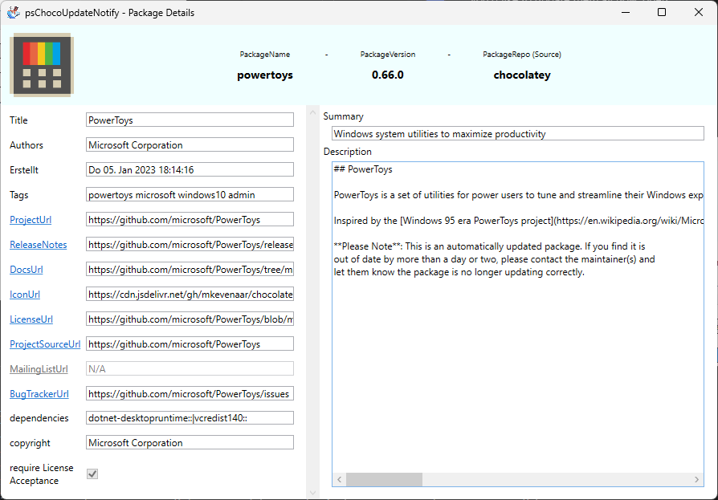

# psChocoUpdateNotify

Searches for chocolatey package updates and notifies the user about it. Includes a GUI where you can choose what to update

* [Features](#features)
* [Install](#install)
  * [As a powershell module](#as-a-powershell-module)
  * [Manual](#manual)
  * [Other](#other)
* [Update](#update)
  * [As a powershell module](#as-a-powershell-module-1)
  * [Manual](#manual-1)
* [Usage](#usage)
  * [First Start](#first-start)
  * [Settings](#settings)
  * [Parameters](#parameters)
* [Credits/Acknowledgements](#creditsacknowledgements)

## Features

* Get notified about outdated chocolatey packages through a windows toast notification on every logon  
  
* List all outdated packages in a simple graphical interface  
  
* Install all or a subset of your outdated packages with three different options
  * `Silent`: Don't ask for confirmation when updating chocolatey packages (Choco parameter `-y`)
  * `Hidden`: Don't show the chocolatey window
  * `WhatIf`: Don't make any changes. This is just for testing purposes
* Show detailed information about a package when double-clicking it.  
  

## Install

The first mentioned method is the preferred method.  
The last mentioned method is the least preferred method.

You might want to have a look at [first start](#first-start) after the installation

### As a powershell module

Simply run `Install-Module -Name psChocoUpdateNotify -Scope AllUsers` and then start the script with `Start-PSChocoUpdateNotify` in any powershell session.

### Manual

1. Open the [Releases-Page](https://github.com/we-mi/psChocoUpdateNotify/releases) and download the latest ZIP-File.
2. Extract the ZIP-File to a destination of your choice.
3. Open the extracted folder, right-click the file `psChocoUpdate-Notify.ps1` and choose `Run with powershell`

### Other

If you know what you're doing you can [Download](https://github.com/we-mi/psChocoUpdateNotify/archive/refs/heads/main.zip) the latest source code and start it the same way as described in the [manual](#manual) method.

## Update

### As a powershell module

This is as simple as running `Update-Module psChocoUpdateNotify`.

You might need to reopen your powershell session or unload the old module with `Remove-Module psChocoUpdateNotify` in order to have powershell use the new module.

### Manual

1. Open the [Releases-Page](https://github.com/we-mi/psChocoUpdateNotify/releases) and download the latest ZIP-File.
2. Extract the ZIP-File to a destination of your choice.
   1. You *can* use the same folder and just replace the old files to skip the first start-questions, except something fundamental changed), but you can just use another folder.
3. Open the extracted folder, right-click the file `psChocoUpdate-Notify.ps1` and choose `Run with powershell`

## Usage

The usage is mostly self explanatory, so I will only mention the non-self-explanatory points.  
If you feel like something was not mentioned or is unclear, please create an [issue](https://github.com/we-mi/psChocoUpdateNotify/issues/new).

### First Start

Be sure to set your [ExecutionPolicy](https://docs.microsoft.com/en-us/powershell/module/microsoft.powershell.core/about/about_execution_policies) accordingly or this script might not start.

You will get a notification window on your first start, which will warn you that some basic things are not setup yet or have been changed (maybe due to an update).  

If you click `Yes` here, you might get asked for elevated permissions in order to update values in the registry (see below) and create a scheduled task.

These "basic things" includes:

* The presence of two protocol handlers.
  * They are needed when you click on `Update` or `GUI` in the notification window and are currently the only (?) way to execute code when you click on a button in a notification window created with the [BurntToast-Module](https://github.com/Windos/BurntToast).  
  * You can choose to disable this notification window and don't install the protocol handlers, but clicking the buttons `Update` or `GUI` in [this](doc/img/Toast.png) Notification won't work at all or not the way you expect it to work.  
  * The protocol handlers are located in `HKEY_CLASSES_ROOT\psChocoUpdateNotifyUpdate` and `HKEY_CLASSES_ROOT\psChocoUpdateNotifyGUI`. Feel free to inspect them.
  * You are able to call the code behind the protocol handlers not only from [this](doc/img/Toast.png) Notification but also if you type `psChocoUpdateNotifyUpdate:` or `psChocoUpdateNotifyGUI:` in the Windows-`Run`-Dialog (`WIN` + `R`). This is **exactly** the same as if you click on `Update` or `GUI`.
* A scheduled task which runs on every logon
  * This assures that you get notified regularly.
  * The scheduled task is located in the folder `psChocoUpdateNotify` in Windows `Scheduled Task`-Management Console.

### Settings

Currently most of the settings can only be modified manually and not from within the GUI.

These are the settings you can change:

| Section | Name | Description | Default |
| --- | --- | --- | --- |
| choco_options | silent | Does not ask for confirmation when updating choco packages (`-y`-parameter for choco.exe). Can be `True` or `False`. Last state of checkbox is saved | `False` |
| choco_options | hidden | Hides the chocolatey window, automatically enables the `silent`-option. Can be `True` or `False`. Last state of checkbox is saved | `False` |
| choco_options | whatif | Does not make any changes, this is mainly for testing purposes. Can be `True` or `False`. Last state of checkbox is saved | `False` |
| general | IgnoreStartUpChecks | Disable the presence-check of the two protocol handlers and the scheduled task. Can be `True` or `False` | `False` |
| updater | checkVersionOnStartup | Checks if a new version is available on every startup. Can be `True` or `False` | `True` |
| updater | proxy | Sets a proxy for the update check. Must be a valid proxy-string like `http://myproxy.example.com:3128` | None |
| updater | proxyUserName | Sets a username for the proxy. Can be any string | None |
| updater | proxyPassword | Sets a password for the proxy. Can be any string | None |
| updater | timeout | Sets a timeout in seconds for the update-check | `5` |

### Parameters

You can alter the startup-behaviour with these parameters:

| Parameter-Name | Description | Default |
| --- | --- | --- |
| Mode | Can be `Notification` or `GUI`  Forces the script to start either the Notification or the GUI | `Notification` |
| IgnoreStartupChecks | Specify to disable the presence-check of the two protocol handlers and the scheduled task | False |
| SkipGUIInitialSearch |  Skipping the automatic search for update when the GUI starts. Click the button `Search outdated packages` to get a list of outdated packages | False |
| SettingsFile | Path to the json-settings file | `%APPDATA%\psChocoUpdateNotify\settings.json` |

## Credits/Acknowledgements

The 'hot chocolate' logo in the main window, in the notification-window and in the taskbar was designed by kerismaker and can be found [here](https://www.flaticon.com/free-icons/hot-chocolate).

The following 3rd party components are used in this project

* [MdXaml](https://github.com/whistyun/MdXaml); Released under the [MIT-License](https://github.com/whistyun/MdXaml/blob/master/LICENSE.txt); Used for rendering Markdown-Text
* [AvalonEdit](https://github.com/icsharpcode/AvalonEdit); Released under the [MIT-License](https://github.com/icsharpcode/AvalonEdit/blob/master/LICENSE); Used as a dependency for MdXaml
